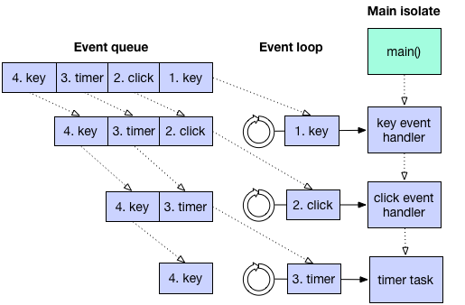
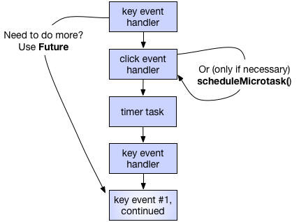
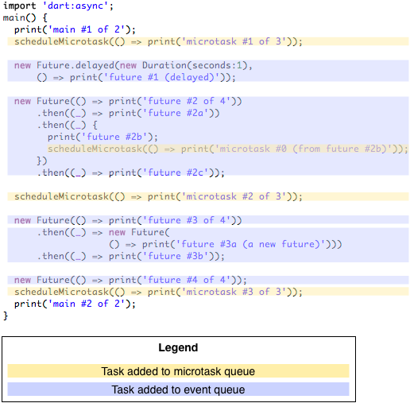
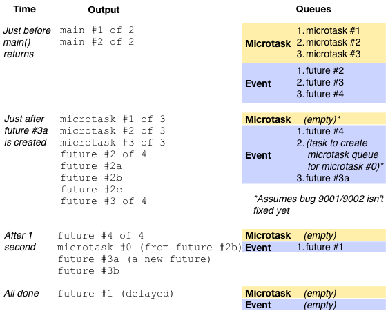

_Written by Kathy Walrath  
September 2013 (updated October 2013)_

Asynchronous code is everywhere in Dart.
Many library functions return Future objects,
and you can register handlers to respond to events such as
mouse clicks, file I/O completions, and timer expirations.

This article describes Dart’s event loop architecture,
so that you can write better asynchronous code with fewer surprises.
You’ll learn options for scheduling future tasks,
and you’ll be able to predict the order of execution.

<aside class="alert alert-info" markdown="1">
**Note:**
Everything in this article applies both to Dart apps running natively
(using a Dart VM such as dart or in Dartium)
and to Dart apps that have been compiled to JavaScript
(the output of dart2js).
This article uses the term _Dart_ to differentiate between
Dart apps and software written in other languages.
</aside>

Before reading this article,
you should be familiar with the basics of
[Futures and Error Handling]({{site.dartlang}}/articles/libraries/futures-and-error-handling).

## Basic concepts

If you’ve written UI code,
you’re probably familiar with the concepts of
the _event loop_ and the _event queue_.
They ensure that graphics operations and events
such as mouse clicks are handled one at a time.

### Event loops and queues

An event loop’s job is to take an item from the event queue and handle it,
repeating these two steps for as long as the queue has items.

The items in the queue might represent user input,
file I/O notifications, timers, and more.
For example, here’s a picture of the event queue that contains
timer and user input events:

All of that might be familiar from non-Dart languages you know.
Now let’s talk about how it fits into the Dart platform.

### Dart’s single thread of execution

Once a Dart function starts executing,
it continues executing until it exits.
In other words, Dart functions can’t be interrupted by other Dart code.

<aside class="alert alert-info" markdown="1">
**Note:**
A Dart _command-line_ app can run code in parallel by creating _isolates_.
(Dart _web_ apps can’t currently create additional isolates,
but they can create _workers_.)
Isolates don’t share memory;
they’re like separate apps that communicate with each other
by passing messages.
With the exception of code that an app explicitly
runs in additional isolates or workers,
all of an app’s code runs in the app’s _main isolate_.
For more information, see
[Use isolates or workers if necessary](#use-isolates-or-workers-if-necessary),
later in this article.
</aside>

As the following figure shows,
a Dart app starts execution when
its main isolate executes the app’s main() function.
After main() exits,
the main isolate's thread begins to handle any items on the app’s event queue,
one by one.

Actually, that’s a slight oversimplification.

### Dart’s event loop and queues

A Dart app has a single event loop with _two_ queues—the
_event queue_ and the _microtask queue_.

The **event queue** contains all outside events:
I/O, mouse events, drawing events, timers,
messages between Dart isolates, and so on.

The **microtask queue** is necessary because
event-handling code sometimes needs to complete a task later,
but before returning control to the event loop.
For example, when an observable object changes,
it groups several mutation changes together
and reports them asychronously.
The microtask queue allows the observable object
to report these mutation changes
before the DOM can show the inconsistent state.

The event queue contains events both from Dart and
from elsewhere in the system.
Currently, the microtask queue contains only entries originating
from within Dart code,
but we expect the web implementation to plug into
the browser microtask queue.
(For the latest status, see
[dartbug.com/13433](https://github.com/dart-lang/sdk/issues/13433).)

As the following figure shows,
when main() exits,
the event loop starts its work.
First, it executes any microtasks, in FIFO order.
Then it dequeues and handles the first item on the event queue.
Then it repeats the cycle: execute all microtasks,
and then handle the next item on the event queue.
Once both queues are empty and no more events are expected,
the app’s _embedder_ (such as the browser or a test framework)
can dispose of the app.

<aside class="alert alert-info" markdown="1">
**Note:**
If a web app’s user closes its window,
then the web app might exit before its event queue is empty.
</aside>

<aside class="alert alert-warning" markdown="1">
**Important:**
While the event loop is executing tasks from the microtask queue,
the event queue is stuck:
the app can’t
draw graphics, handle mouse clicks, react to I/O, and so on.
</aside>

Although you can predict the _order_ of task execution,
you can’t predict exactly _when_ an event loop will take a task off the queue.
The Dart event handling system is based on a single-threaded cycle;
it isn’t based on ticks or any other kind of time measurement.
For example, when you create a delayed task,
an event is enqueued at the time you specify.
However, that event can’t be handled until
everything before it in the event queue
(as well as every single task in the microtask queue) is handled.

## Tip: Chain futures to specify task order

If your code has dependencies, make them explicit.
Explicit dependencies help other developers to understand your code,
and they make your program more resistant to code refactoring.

Here’s an example of the _wrong_ way to code:


// BAD because of no explicit dependency between setting and using
// the variable.
future.then(...set an important variable...);
Timer.run(() {...use the important variable...});


Instead, write code like this:


// BETTER because the dependency is explicit.
future.then(...set an important variable...)
  .then((_) {...use the important variable...});


The better code uses then() to specify that
the variable must be set before it can be used.
(You can use whenComplete() instead of then()
if you want the code to execute even if an error occurs.)

If using the variable takes time and can be done later,
consider putting that code in a new Future:


// MAYBE EVEN BETTER: Explicit dependency plus delayed execution.
future.then(...set an important variable...)
  .then((_) {new Future(() {...use the important variable...})});


Using a new Future gives the event loop a chance to
process other events from the event queue.
The next section gives details on scheduling code to run later.

## How to schedule a task

When you need to specify some code to be executed later,
you can use the following APIs provided by the dart:async library:

1. The **Future** class,
which adds an item to the end of the **event queue**.
1. The top-level **scheduleMicrotask()** function,
which adds an item to the end of the **microtask queue**.

<aside class="alert alert-info" markdown="1">
**Note:**
The **scheduleMicrotask()** function used to be named **runAsync()**.
(See the [announcement](https://groups.google.com/a/dartlang.org/d/msg/misc/7sAIhWXfIKQ/PzYJy1QqtWUJ).)
</aside>

Examples of using these APIs are in the next section under
[Event queue: new Future()](#event-queue-new-future) and
[Microtask queue: scheduleMicrotask()](#microtask-queue-schedulemicrotask).

### Use the appropriate queue (usually: the event queue)

Whenever possible, schedule tasks on the event queue, with Future.
Using the event queue helps keep the the microtask queue short,
reducing the likelihood of the microtask queue starving the event queue.

If a task absolutely must complete before
any items from the event queue are handled,
then you should usually just execute the function immediately.
If you can’t, then use scheduleMicrotask() to
add an item to the microtask queue.
For example, in a web app use a microtask to
avoid prematurely releasing a js-interop proxy or
ending an IndexedDB transaction or event handler.

#### Event queue: new Future()

To schedule a task on the event queue,
use `new Future()` or `new Future.delayed()`.
These are two of the
[Future]({{site.dart_api}}/dart-async/Future-class.html)
constructors defined in the dart:async library.

<aside class="alert alert-info" markdown="1">
**Note:**
You can also use
[Timer]({{site.dart_api}}/dart-async/Timer-class.html) to schedule tasks,
but if any uncaught exceptions occur in the task,
your app will exit.
Instead, we recommend Future,
which is built on top of Timer and adds features such as
detecting task completion and responding to errors.
</aside>

To immediately put an item on the event queue, use `new Future()`:


// Adds a task to the event queue.
new Future(() {
  // ...code goes here...
});


You can add a call to `then()` or `whenComplete()` to
execute some code immediately after the new Future completes.
For example, the following code prints “42” when
the new Future’s task is dequeued:


new Future(() => 21)
    .then((v) => v*2)
    .then((v) => print(v));


To enqueue an item after some time elapses, use `new Future.delayed()`:


// After a one-second delay, adds a task to the event queue.
new Future.delayed(const Duration(seconds:1), () {
  // ...code goes here...
});


Although the preceding example adds the task to the event queue
after one second,
that task can’t execute until the main isolate is idle,
the microtask queue is empty,
and previously enqueued entries in the event queue are gone.
For example, if the main() function or an event handler are
running an expensive computation,
the task can’t execute until after that computation completes.
In that case, the delay might be much more than one second.

<aside class="alert alert-info" markdown="1">
**Tip:**
If you’re drawing frames for animation in a web app,
don’t use a Future (or Timer or Stream).
Instead, use
[animationFrame]({{site.dart_api}}/dart-html/Window/animationFrame.html),
which is the Dart interface to
[requestAnimationFrame](http://www.html5rocks.com/en/tutorials/speed/animations/).
</aside>

Fun facts about Future:

1. The function that you pass into Future’s **then()** method
executes immediately when the Future completes.
(The function isn’t enqueued, it’s just called.)
1. If a Future is _already complete_ before **then()** is invoked on it,
then a task is added to the _microtask queue_,
and _that_ task executes the function passed into then().
1. The **Future()** and **Future.delayed()** constructors
don’t complete immediately;
they add an item to the event queue.
1. The **Future.value()** constructor completes in a microtask,
similar to #2.
1. The **Future.sync()** constructor executes its function argument immediately
and (unless that function returns a Future)
completes in a microtask, similar to #2.

#### Microtask queue: scheduleMicrotask()

The dart:async library defines scheduleMicrotask() as a top-level function.
You can call scheduleMicrotask() like this:


scheduleMicrotask(() {
  // ...code goes here...
});


Due to bugs [9001](https://github.com/dart-lang/sdk/issues/9001)
and [9002](https://github.com/dart-lang/sdk/issues/9002),
the first call to scheduleMicrotask() schedules a task on the event queue;
this task creates the microtask queue and
enqueues the function specified to scheduleMicrotask().
As long as the microtask queue has at least one entry,
subsequent calls to scheduleMicrotask() correctly add to the microtask queue.
Once the microtask queue is empty,
it must be created again the next time scheduleMicrotask() is called.

The upshot of these bugs:
The first task that you schedule with scheduleMicrotask() seems
like it’s on the event queue.

A workaround is to put your first call to scheduleMicrotask() before
your first call to new Future().
This creates the microtask queue before
executing other tasks on the event queue.
However, it doesn’t stop external events from being added to the event queue.
It also doesn’t help when you have a delayed task.

Another way to add a task to the microtask queue is
to invoke then() on a Future that’s already complete.
See the previous section for more information.

### Use isolates or workers if necessary

What if you have a compute-intensive task to run?
To keep your app responsive,
you should put the task into its own isolate or worker.
Isolates might run in a separate process or thread,
depending on the Dart implementation.
In 1.0 we don’t expect web apps to support isolates or Dart-language workers.
However, you can use the
[dart:html Worker class]({{site.dart_api}}/dart-html/Worker-class.html)
to add a JavaScript worker to a Dart web app.

How many isolates should you use? For compute-intensive tasks,
you should generally use as many isolates as you expect to have CPUs available.
Any additional isolates are just wasted if they’re purely computational.
However, if the isolates perform asynchronous calls—to perform I/O,
for example—then they won’t spend much time on the CPUs,
so having more isolates than CPUs makes sense.

You can also use more isolates than CPUs
if that’s a good architecture for your app.
For example, you might use a separate isolate
for each piece of functionality,
or when you need to ensure that data isn't shared.

## Test your understanding

Now that you’ve read all about scheduling tasks,
let’s test your understanding.

Remember, you shouldn’t depend on Dart’s event queue implementation
to specify task order.
The implementation might change,
and Future’s then() and whenComplete() methods are a better alternative.
Still, won’t you feel smart if you can answer these questions correctly?

### Question #1

What does this sample print out?


import 'dart:async';
main() {
  print('main #1 of 2');
  scheduleMicrotask(() => print('microtask #1 of 2'));

  new Future.delayed(new Duration(seconds:1),
                     () => print('future #1 (delayed)'));
  new Future(() => print('future #2 of 3'));
  new Future(() => print('future #3 of 3'));

  scheduleMicrotask(() => print('microtask #2 of 2'));

  print('main #2 of 2');
}


The answer:


main #1 of 2
main #2 of 2
microtask #1 of 2
microtask #2 of 2
future #2 of 3
future #3 of 3
future #1 (delayed)


That order should be what you expected,
since the example’s code executes in three batches:

1. code in the main() function
1. tasks in the microtask queue (scheduleMicrotask())
1. tasks in the event queue (new Future() or new Future.delayed())

Keep in mind that all the calls in the main() function execute synchronously,
start to finish.
First main() calls print(), then scheduleMicrotask(),
then new Future.delayed(), then new Future(), and so on.
Only the callbacks—the code in the closure bodies specified as
arguments to scheduleMicrotask(), new Future.delayed(), and
new Future()—execute at a later time.

<aside class="alert alert-info" markdown="1">
**Note:**
Currently, if you comment out the first call to scheduleMicrotask(),
then the callbacks for futures #2 and #3 execute before microtask #2.
This is due to bugs 9001 and 9002, as discussed in
[Microtask queue: scheduleMicrotask()](#microtask-queue-schedulemicrotask).
</aside>

### Question #2

Here’s a more complex example.
If you can correctly predict the output of this code,
you get a gold star.


import 'dart:async';
main() {
  print('main #1 of 2');
  scheduleMicrotask(() => print('microtask #1 of 3'));

  new Future.delayed(new Duration(seconds:1),
      () => print('future #1 (delayed)'));

  new Future(() => print('future #2 of 4'))
      .then((_) => print('future #2a'))
      .then((_) {
        print('future #2b');
        scheduleMicrotask(() => print('microtask #0 (from future #2b)'));
      })
      .then((_) => print('future #2c'));

  scheduleMicrotask(() => print('microtask #2 of 3'));

  new Future(() => print('future #3 of 4'))
      .then((_) => new Future(
                   () => print('future #3a (a new future)')))
      .then((_) => print('future #3b'));

  new Future(() => print('future #4 of 4'));
  scheduleMicrotask(() => print('microtask #3 of 3'));
  print('main #2 of 2');
}


The output, assuming bugs 9001/9002 aren't fixed:


main #1 of 2
main #2 of 2
microtask #1 of 3
microtask #2 of 3
microtask #3 of 3
future #2 of 4
future #2a
future #2b
future #2c
future #3 of 4
future #4 of 4
microtask #0 (from future #2b)
future #3a (a new future)
future #3b
future #1 (delayed)


<aside class="alert alert-info" markdown="1">
**Note:**
Due to bugs 9001/9002,
microtask #0 executes after future #4;
it should instead execute before future #3.
This bug shows up because by the time future #2b executes,
no microtasks are queued,
so microtask #0 results in a new task on the event queue,
which creates a new microtask queue.
This microtask queue contains microtask #0.
If you comment out microtask #1,
then the microtasks all appear together just after future #2c,
and before future #3.
</aside>

Like before, the main() function executes,
and then everything on the microtask queue,
and then tasks on the event queue.
Here are a few interesting points:

* When the then() callback for future 3 calls new Future(),
it creates a new task (#3a) that’s added to the end of the event queue.
* All the then() callbacks execute as soon as
the Future they’re invoked on completes.
Thus, future 2, 2a, 2b, and 2c execute all in one go,
before control returns to the embedder.
Similarly, future 3a and 3b execute all in one go.
* If you change the 3a code from
`then((_) => new Future(...))` to
`then((_) {new Future(...); })`,
then "future #3b" appears earlier
(after future #3, instead of future #3a).
The reason is that returning a Future from your callback
is how you get then() (which itself returns a new Future)
to _chain_ those two Futures together,
so that the Future returned by then() completes
when the Future returned by the callback completes.
See the [then() reference]({{site.dart_api}}/dart-async/Future/then.html)
for more information.

#### Annotated sample and output

Here are some figures that might clarify the answer to question #2.
First, here’s the annotated program source:

And here’s what the queues and output look like at various points in time,
assuming no external events come in:

## Summary

You should now understand Dart’s event loops and how to schedule tasks.
Here are some of the major concepts of event loops in Dart:

* A Dart app’s event loop executes tasks from two queues:
the event queue and the microtask queue.
* The event queue has entries from both Dart
(futures, timers, isolate messages, and so on)
and the system (user actions, I/O, and so on).
* Currently, the microtask queue has entries only from Dart,
but we expect it to be merged with the browser microtask queue.
* The event loop empties the microtask queue before
dequeuing and handling the next item on the event queue.
* Once both queues are empty, the app has completed its work
and (depending on its embedder) can exit.
* The main() function and all items from the microtask and event queues
run on the Dart app’s main isolate.

When you schedule a task, follow these rules:

* If possible, put it on the event queue
(using new Future() or new Future.delayed()).
* Use Future's then() or whenComplete() method to specify task order.
* To avoid starving the event loop,
keep the microtask queue as short as possible.
* To keep your app responsive,
avoid compute-intensive tasks on either event loop.
* To perform compute-intensive tasks,
create additional isolates or workers.

As you write asynchronous code, you might find these resources helpful:

* [Futures and Error Handling]({{site.dartlang}}/articles/libraries/futures-and-error-handling)
* [dart:async - Asynchronous Programming]({{site.dartlang}}/guides/language/language-tour#asynchrony-support)
  section of the library tour
* [dart:async API reference]({{site.dart_api}}/dart-async/dart-async-library.html)


The tests for this article are at /src/tests/site/articles/event-loop.

